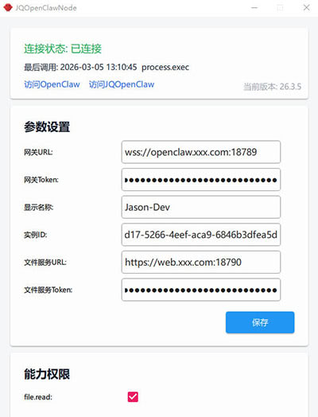
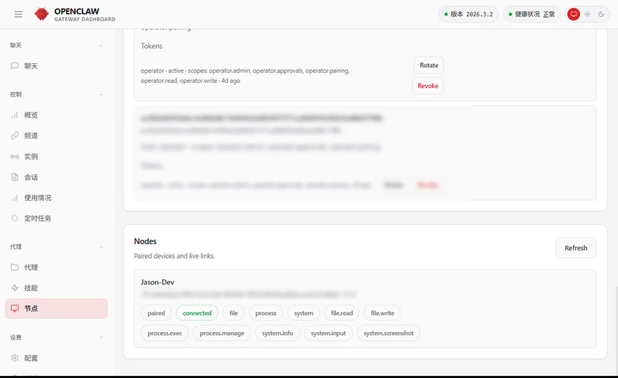

# JQOpenClaw

JQOpenClaw 是一个基于 Qt/C++ 开发的 OpenClaw Node，实现与 OpenClaw Gateway 的 Node WebSocket 协议对接。

适用于希望在 Windows 上以独立可执行程序接入 OpenClaw 的场景，无需额外安装 Node.js 与 OpenClaw CLI。

注意：本项目不是 OpenClaw Gateway 的替代品，而是 OpenClaw Node 的实现。

Gateway 是中枢/控制平面，Node 是执行端/能力提供者。通常一个 Gateway 可以统一调度多个 Node。

## 项目定位

- 运行平台：Windows（后续计划扩展到 Mac / Linux）。
- 运行形态：免安装，单可执行程序（`JQOpenClawNode.exe`）接入 Gateway。
- 能力范围：文件、进程、系统信息、截图与输入控制（详见下文“节点能力与命令”）。
- 开发套件：`Qt 6.5.3 + MSVC`。
- 协议兼容：对接 OpenClaw Gateway 的 `node.invoke` 调用链路。

## 首次使用

### 1. 前置条件

在启动 JQOpenClawNode 前，请先确认：

- OpenClaw Gateway 已可用，并且有一个可用的访问地址，本机 ```127.0.0.1```、局域网、公网都行。
- Gateway 已配置可用的 token（Node 连接时会使用）。
- 确保你已经在浏览器成功访问 OpenClaw Gateway，可以进行对话。已经解决了诸如SSL配置，白名单，安全限制等问题。

### 2. 下载与启动

推荐直接下载已编译版本：

- 最新发布页：[https://github.com/188080501/JQOpenClaw/releases/latest](https://github.com/188080501/JQOpenClaw/releases/latest)

下载后运行 `JQOpenClawNode.exe`。

### 3. 配置与配对

在程序界面填写配置，点击 `保存` 后会自动发起 WebSocket 连接并进入待配对状态。

等待配对时，需要在 Gateway 侧批准该节点，批准后即可完成配对。

### 4. 连接失败时优先检查

- `gatewayUrl` 是否为正确的 `ws://` 或 `wss://` 地址。
- `token` 是否与 Gateway 配置一致。
- 节点机器与 Gateway 之间的网络/防火墙是否可达。

### 5. 完成配对

当界面状态显示“已连接”时，表示配对成功，此时可以在 Gateway 中调用该 Node 能力。



### 6. 导入配套 Skill（必做）

为保证 Gateway 按正确方式调用 Node 能力，请先导入配套 Skill。

导入入口文件（相对仓库根目录）：
`docs/skills/jqopenclaw-node-invoker/SKILL.md`

### 7. 放行 Gateway 白名单（必做）

当前 JQOpenClawNode 提供了较多命令，但这些命令默认不在官方 OpenClaw 的 `openclaw.json` 白名单中。

即使已经导入 Skill，如果网关未放行对应命令，调用仍会被拦截，并出现 `command not allowlisted`。

请在 Gateway 所在机器的 `~/.openclaw/openclaw.json` 中，手动将本节点命令加入 `gateway.nodes.allowCommands`，至少包含你实际要使用的命令，例如：

```json5
{
  gateway: {
    nodes: {
      allowCommands: [
        "file.read",
        "file.write",
        "process.manage",
        "system.run",
        "process.which",
        "system.info",
        "system.screenshot",
        "system.notify",
        "system.clipboard",
        "system.input",
        "node.selfUpdate"
      ]
    }
  }
}
```

修改配置后，请重启 Gateway（或执行配置重载）再重试调用。

### 8. 在 Gateway 发起简单测试（验证连通）

完成前 7 步后，可以在 Gateway 里直接发起下面两段对话测试：

对话示例 1（测试 `system.info`）：

```text
请对 nodeId=<你的节点ID> 调用 system.info，返回关键结果。
```

对话示例 2（测试 `process.which`）：

```text
请对 nodeId=<你的节点ID> 调用 process.which，program=cmd。
```

若调用返回成功且有有效 `payload`，说明 Node 与 Gateway 的连接及命令调用链路正常。

## 可配置参数说明

| 参数名 | 配置键 | 是否必填 | 默认值 | 说明 |
| --- | --- | --- | --- | --- |
| 网关URL | gatewayUrl | 是 | `ws://127.0.0.1:18789` | Gateway WebSocket 地址，只支持 `ws://` 或 `wss://`。 |
| 网关Token | token | 是 | 空 | Gateway token，留空会导致连接失败。 |
| 显示名称 | displayName | 否 | 自动生成（如 `JQOpenClawNode-1234`） | 节点显示名称。 |
| 实例ID | instanceId | 否 | 首次启动自动生成 UUID | 节点实例 ID。 |
| 文件服务URL | fileServerUrl | 否 | 空 | 文件服务基础 URL（必须是 Nginx 对外入口），用于截图上传。 |
| 文件服务Token | fileServerToken | 条件必填 | 空 | 使用 `system.screenshot` 上传时必填。 |

说明：仅当需要使用 `system.screenshot` 上传截图时，才需要配置 `fileServerUrl` 与 `fileServerToken`，否则可留空。

### URL 配置注意事项

- `网关URL` 必须是合法 URL，且带 `ws`/`wss` 协议和主机名。
- 文件服务必须经过 Nginx 中转，Node 会向 Nginx 执行上传并返回访问链接。
- `文件服务URL` 请填写 Nginx 对外“基础地址”，不要手动加 `/upload` 或 `/files`，也不要填写磁盘目录或对象存储内部地址。
- 程序会在截图上传时自动拼接：
  - 上传地址：`<文件服务URL>/upload/<随机文件名>.jpg`
  - 访问地址：`<文件服务URL>/files/<随机文件名>.jpg`

### 配对成功后在 OpenClaw 中的显示位置

Node 配对成功后，会在 OpenClaw 中显示在如下位置，便于快速确认节点是否已成功接入：



## 节点能力与命令

| 能力分类 | 命令 | 能力说明 |
| --- | --- | --- |
| file | file.read | 支持 `operation=read/lines/list/rg/stat/md5`：文件读取（含 `offsetBytes` 分块，`maxBytes` 上限 `2097152`）、按行区间读取（`startLine~endLine`）、目录遍历（含 `recursive/glob`）、元信息查询（owner/权限/时间戳）与文件 MD5 计算。 |
| file | file.write | 支持写入/移动（剪切）/删除（回收站）/目录创建/目录删除，以及 `operation=write/move/delete/mkdir/rmdir`、`createDirs/overwrite` 参数。 |
| process | process.manage | 进程管理能力，支持 `operation=list/search/kill`：进程列表、按关键字或 PID 搜索、按 PID 终止进程。 |
| system | system.run | 基于 QProcess 远程执行进程命令，返回 `exitCode/stdout/stderr` 等结果；支持 `command`（argv 数组）/`program+arguments`、`cwd`/`workingDirectory`、`env`/`environment`、`commandTimeoutMs`/`timeoutMs`、`needsScreenRecording`；并忽略 `PATH` 覆盖与高风险环境变量注入。 |
| process | process.which | 可执行命令探测能力，支持单个 `program` 或批量 `programs`，返回是否存在与可执行路径。 |
| system | system.screenshot | 采集桌面截图并返回图片信息（JPG）。 |
| system | system.info | 采集系统基础信息（CPU 名称+核心/线程、计算机名/主机名、系统名称/版本、用户名、内存、GPU、IP、硬盘容量）。 |
| system | system.notify | 系统弹窗能力，弹出消息提示框（`message` 必填，`title` 可选）。 |
| system | system.clipboard | 系统剪贴板能力，支持 `operation=read/write`：读取当前剪贴板文本，或写入文本到剪贴板。 |
| system | system.input | 输入控制能力，支持动作列表混排：`mouse.move`（绝对/相对）、`mouse.click`（左/右键）、`mouse.scroll`（滚轮，`delta/deltaY` 与可选 `deltaX`）、`mouse.drag`（按键拖拽至目标坐标）、`keyboard.down/up/tap`、`keyboard.text`（文本输入）、`delay`（毫秒延迟）；请求会异步入队并立即返回，若有更新请求到达会取消旧请求剩余动作（latest-wins）。 |
| node | node.selfUpdate | 节点自更新能力：支持下载新版本程序、可选 MD5 校验、生成临时更新脚本并在回包后延迟退出，完成替换与重启。 |

## 项目目录结构

```text
JQOpenClaw
├─ apps/JQOpenClawNode/          # Node 应用入口与命令分发
├─ modules/openclawprotocol/     # 网关握手与 caps/commands/permissions 声明
├─ modules/capabilities/file/    # file 能力实现（file.read / file.write：写入/移动/删除/目录增删）
├─ modules/capabilities/process/ # process 能力实现（process.manage / process.which）
├─ modules/capabilities/system/  # system 能力实现（system.run / system.screenshot / system.info / system.notify / system.clipboard / system.input）
├─ modules/crypto/               # 设备身份、签名与加解密相关能力
└─ docs/                         # 项目依赖与部署文档
```

## 第三方依赖

- OpenSSL 依赖说明：[docs/OpenSSL依赖.md](docs/OpenSSL依赖.md)
- Nginx 依赖说明：[docs/Nginx依赖.md](docs/Nginx依赖.md)
- Nginx 配置模板：[docs/data.conf](docs/data.conf)
